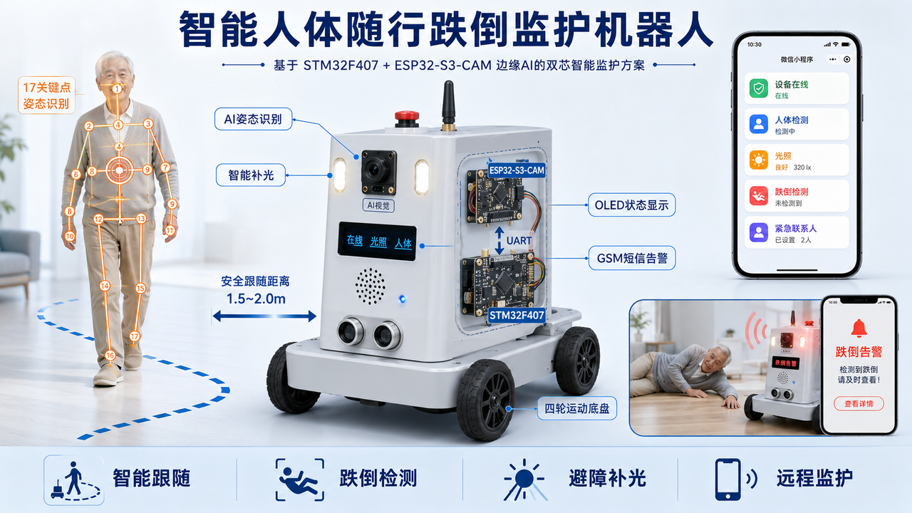
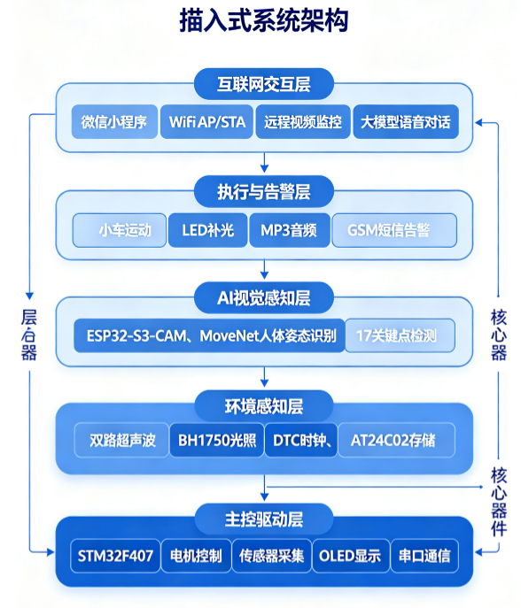

<div align="center">

# 🤖 智能人体随行跌倒监护机器人

**基于 STM32F407 + ESP32-S3 端侧 AI 的双芯片智能监护方案**

[](LICENSE)
[]()
[]()
[]()

[功能特性](#-功能特性) · [系统架构](#-系统架构) · [硬件清单](#-硬件清单) · [快速开始](#-快速开始) · [开发计划](#-开发计划)

</div>

---

## 📖 项目简介

本项目设计一款**基于 STM32 与 ESP32-S3 端侧 AI 的智能人体随行跌倒监护机器人**。采用双芯片解耦架构，STM32 负责底层运动控制、传感器处理、数据存储与外设管理，ESP32-S3-CAM 搭载轻量化 MoveNet 人体姿态模型实现端侧人体感知。

系统集成 **AI 人体智能跟随、人体跌倒检测、智能暗光补光、超声波避障、GSM 短信告警、微信小程序远程监控与配置、远程实时视频监控、大模型智能语音对话、生活陪伴功能**。设备支持本地热点局域网使用，同时支持路由器 STA 联网外网访问，实现近远程一体化智能监护。

> 🎯 **适用场景**：嵌入式 / 物联网 / AIoT 面试实战项目、毕业设计、老年人居家监护



---

## ✨ 功能特性

### 🧠 AI 人体智能跟随（核心）
- ESP32-S3 端侧部署 MoveNet 姿态模型，识别人体 17 个关键点
- 通过肩部、髋关节坐标加权计算**人体躯干重心**作为跟随目标
- 重心跟随相比传统脚踝跟随更稳定，适配转身、侧身、下蹲等姿态
- 串口传输偏移方位 + 超声波距离融合，实现稳定随行

### 🚨 人体跌倒检测与短信告警
- 复用姿态关键点数据，计算人体躯干倾斜角度
- **多帧防抖校验算法**过滤弯腰、下蹲误判
- 跌倒超时触发：小车停止、屏幕告警、提示音、GSM 短信通知紧急联系人
- 小程序可自由设置跌倒判定时长与紧急联系人

### 💡 智能暗光补光
- BH1750 实时采集环境光照强度
- 「环境昏暗 + 检测到人体」双条件触发 LED 补光
- 无人状态自动关灯，兼顾功耗与识别精度

### 🛡️ 超声波智能避障
- 双路 HC-SR04 实时检测前方障碍物距离
- 低于安全阈值自动停止或后退，避免碰撞

### 📱 微信小程序全功能交互（核心交互）
- 无需安装 APP，支持**本地局域网 + 外网远程监控**
- 远程设置闹钟、编辑备忘录、自定义铃声（支持上传手机本地 MP3）
- 开关跌倒检测、设置紧急联系人与告警阈值
- 实时查看设备状态、光照数据、人体检测状态、告警记录
- 远程实时查看摄像头画面（HLS 视频流）

### 🌐 AP/STA 双模式 WiFi 架构
- **AP 热点模式**：首次开机 / 配网键 / WiFi 失败时开启，用于本地配置
- **STA 路由模式**：正常运行模式，连接路由器实现外网远程访问
- 配网成功后自动切回 STA，AP 条件触发不常驻

### 🎥 远程实时视频监控
- ESP32-S3-CAM 采集 JPEG/MJPEG 帧，HTTPS 主动推流至云端服务器
- 云端 ffmpeg 转码为 HLS（m3u8 + ts），Nginx + HTTPS 分发
- 微信小程序 video 组件实时播放，适配家用动态 IP 与 CGNAT 网络

### 🗣️ 大模型智能语音对话
- 语音链路：INMP441 麦克风 → 云端 ASR → 大模型 → 云端 TTS → JQ8900 播放
- 采用**硅基流动（SiliconFlow）托管的开源 Qwen2.5 系列模型**
- OpenAI 兼容 API，ESP32-S3 通过 HTTPS 直接调用，无需自建服务
- 支持多轮连续对话，可结合监护信息实现健康提醒与安全问答

### ⏰ 生活陪伴与数据持久化
- 硬件 RTC 时钟，断电保时
- AT24C02 存储所有用户配置，断电不丢失
- 闹钟提醒、备忘录、OLED 信息显示、音频播放

---

## 🏗️ 系统架构

系统采用**五层模块化架构**，分工清晰、耦合度低：



| 层级 | 核心器件 | 主要职责 |
|------|----------|----------|
| **物联网交互层** | ESP32-S3 WiFi | 微信小程序通信、AP/STA 双模式、远程视频推流、大模型语音交互 |
| **执行与告警层** | L298N / LED / JQ8900 / SIM800L | 小车运动、智能补光、音频提示、GSM 短信告警 |
| **AI 视觉感知层** | ESP32-S3-CAM | MoveNet 姿态推理、17 关键点检测、跟随偏移量与跌倒状态输出 |
| **环境感知层** | HC-SR04×2 / BH1750 / RTC / AT24C02 | 超声波测距、光照检测、实时时钟、数据持久化 |
| **主控驱动层** | STM32F407VET6 | 电机控制、传感器采集、OLED 显示、串口协议解析、告警逻辑 |

**双芯片通信**：STM32 与 ESP32-S3 通过 UART 串口通信，定义统一协议帧传输人体方位、跟随指令、状态数据等。

---

## 🛒 硬件清单

| 序号 | 器件名称 | 型号规格 | 数量 | 功能用途 |
|------|----------|----------|------|----------|
| 1 | STM32 主控核心板 | STM32F407VET6 | 1 | 整车控制、外设驱动、串口解析、逻辑处理 |
| 2 | 电机驱动模块 | L298N | 1 | 小车电机正反转、调速驱动 |
| 3 | 智能小车底盘 | 4WD TT 电机套件 | 1 | 车体运动机械结构 |
| 4 | 超声波模块 | HC-SR04 | 2 | 测距、防撞、跟随距离判断 |
| 5 | OLED 显示屏 | 0.96 寸 I2C 4 针 | 1 | 时间、备忘录、设备状态、告警显示 |
| 6 | MP3 音频模块 | JQ8900 | 1 | 播放铃声、闹钟、跌倒告警音效、自定义音乐 |
| 7 | AI 视觉通信模块 | ESP32-S3-CAM（8M PSRAM） | 1 | 人体姿态识别、WiFi 通信、小程序交互 |
| 8 | 光照传感器 | BH1750 | 1 | 环境亮度采集、智能补光逻辑判断 |
| 9 | LED 补光模块 | 5V 驱动型 | 1 | 暗光环境 AI 视觉补光 |
| 10 | GSM 短信模块 | SIM800L | 1 | AT 指令发送跌倒短信告警 |
| 11 | RTC 备用电池 | CR2032 | 1 | 时钟断电保时 |
| 12 | 存储模块 | AT24C02 | 1 | 保存闹钟、备忘录、联系人、告警阈值等配置 |
| 13 | 电源与配件 | 18650 电池 + 底座 + 稳压模块 + 杜邦线 | 1 | 整机供电、接线、开关 |
| 14 | I2S 数字麦克风 | INMP441 | 1 | 智能语音对话语音采集 |

---

## 🧰 核心技术栈

- **双芯片嵌入式协同开发**：STM32 实时控制 + ESP32-S3 AI 推理与网络通信，软硬件解耦
- **端侧轻量化 AI 部署**：嵌入式无系统设备部署 MoveNet 姿态模型，人体关键点检测与姿态解算
- **多传感器融合算法**：AI 视觉方位 + 超声波距离融合，实现稳定智能跟随与避障
- **物联网小程序开发**：WiFi TCP 双向通信实现设备控制、参数配置、文件上传、远程监控
- **视频流媒体云中转**：ESP32 推流 → 云端 ffmpeg 转 HLS → Nginx HTTPS 分发 → 小程序播放
- **大模型语音交互**：INMP441 采集 → 云端 ASR / LLM（硅基流动 Qwen2.5）/ TTS → JQ8900 播放
- **GSM 无线通信**：SIM800L AT 指令集，条件触发式短信远程告警
- **WiFi 双模式组网**：AP 本地热点调试 + STA 路由器联网外网远程访问
- **嵌入式数据持久化**：AT24C02 实现所有用户配置断电保存

---

## 📁 项目结构

```
smart-fall-guard-robot/
├── README.md                    # 项目说明文档
├── LICENSE                      # 开源许可证
├── docs/                        # 项目文档
│   ├── images/                  # 文档配图
│   │   ├── concept1.jpg         # 项目概念图
│   │   ├── concept2.jpg         # 开发冲刺甘特图
│   │   └── system-architecture.png  # 系统架构图
│   └── requirements.md          # 需求文档
├── stm32-firmware/              # STM32 固件源码（待开发）
│   ├── Core/                    # 核心代码
│   ├── Drivers/                 # HAL 驱动
│   └── ...
├── esp32-firmware/              # ESP32-S3 固件源码（待开发）
│   ├── main/                    # 主程序
│   ├── components/              # 组件
│   └── ...
├── wechat-miniprogram/          # 微信小程序源码（待开发）
│   ├── pages/                   # 页面
│   ├── utils/                   # 工具函数
│   └── ...
├── cloud-server/                # 云端服务器代码（待开发）
│   ├── stream-server/           # 视频流中转服务
│   └── ...
└── tools/                       # 开发工具与脚本
```

> 📌 **当前阶段**：环境搭建与仓库初始化，各模块代码将按开发计划逐步提交。

---

## 🚀 快速开始

### 环境要求

| 工具 | 版本要求 | 用途 |
|------|----------|------|
| Keil MDK / STM32CubeIDE | ≥ 5.0 | STM32 固件开发 |
| ESP-IDF | ≥ v5.0 | ESP32-S3 固件开发 |
| 微信开发者工具 | 最新版 | 小程序开发与调试 |
| Python | ≥ 3.8 | 辅助脚本、串口调试 |
| Git | ≥ 2.0 | 版本控制 |

### 克隆仓库

```bash
# GitHub
git clone https://github.com/lyj-619/smart-fall-guard-robot.git

# Gitee（国内镜像）
git clone https://gitee.com/LYJ-yanjun/smart-fall-guard-robot.git
```

### 开发进度

各模块代码将按 [开发计划](#-开发计划) 逐步提交，敬请关注仓库更新。

---

## 📅 开发计划

### 7 天冲刺甘特图（2026-09-02 → 09-08）


| 阶段 | 时间 | 任务 | 交付物 |
|------|------|------|--------|
| **M0 启动·软件基座** | D1-D3（9/2-9/4） | 采购下单、环境搭建、双仓库初始化、算法 PC 仿真、框架搭建 | v0.1 基础框架 |
| **M1 硬件到货·点亮** | D4（9/5） | 烧录、电源、电机调试 | v0.2 硬件点亮 |
| **M2+M3 传感器显示** | D5（9/6） | 超声波、OLED、音频、点阵 | v0.3 传感器集成 |
| **M4+M5 AI 视觉协同** | D6（9/7） | MoveNet 跌倒检测与跟随 | v0.4 AI 协同 |
| **M6+M7 集成交付** | D7（9/8） | 小程序、云视频、语音、回归测试 | v1.0 完整交付 |

### 版本节点

- **v0.1**：双仓库初始化 + 算法 PC 仿真 + 软件框架
- **v0.2**：硬件点亮（电源、电机、基础外设）
- **v0.3**：传感器与显示集成
- **v0.4**：AI 视觉协同（跟随 + 跌倒检测）
- **v1.0**：完整功能集成交付

---

## 🧩 项目难点与解决方案

| 难点 | 解决方案 |
|------|----------|
| 传统跟随小车易误跟杂物 | 引入人体姿态识别，只识别真实人体重心，彻底过滤障碍物 |
| 单一帧判断跌倒误判率高 | 多帧连续校验 + 角度阈值滤波，有效过滤下蹲、弯腰假跌倒 |
| 暗光环境识别失效 | 人体联动智能补光机制，有人暗光才开灯，兼顾功耗与精度 |
| 小程序无法自定义闹铃音乐 | 小程序文件上传 API，直接读取手机本地 MP3 上传至设备 |
| 设备只能近距离使用 | AP/STA 双模式 + 路由器端口映射 + 云端 HLS 视频中转 |
| 小程序远程视频传输受限 | ESP32 主动推流至云端，ffmpeg 转 HLS + Nginx 备案域名 HTTPS 分发 |
| 嵌入式设备接入大模型受限 | 硅基流动托管开源 Qwen2.5（OpenAI 兼容 API），ESP32 HTTPS 直接调用 |

---

## 🔮 后续优化方向

### 现存不足
- 强逆光、极暗环境下 AI 姿态识别精度略有下降
- 人体大面积遮挡时会出现识别丢失
- 视频远程监控依赖云端服务器与备案域名
- 控制通道仍依赖路由器端口映射，未使用云平台 MQTT 协议

### 优化计划
- [ ] 优化模型推理参数与补光策略，提升复杂环境识别稳定性
- [ ] 接入阿里云 MQTT 协议，无需端口映射实现全网远程通信
- [ ] 增加多级防抖算法，进一步降低跌倒误判概率
- [ ] 优化 HLS 切片与码率参数，降低视频延迟，提升远程画面流畅度
- [ ] 结合大模型语音对话优化陪伴交互，支持基于语音的健康提醒与安全监护问答
- [ ] **扩展方案**：视觉丢失后的目标找回与呼唤跟随（BLE 手环 RSSI 趋强跟随 / SLAM 建图导航）

---

## 📄 许可证

本项目基于 [MIT License](LICENSE) 开源，可自由使用、修改和分发。

---

## 🤝 贡献

欢迎提交 Issue 和 Pull Request！

1. Fork 本仓库
2. 创建特性分支 (`git checkout -b feature/AmazingFeature`)
3. 提交更改 (`git commit -m 'Add some AmazingFeature'`)
4. 推送到分支 (`git push origin feature/AmazingFeature`)
5. 开启 Pull Request

---

## 📮 联系方式

- **GitHub Issues**：[提交问题](https://github.com/lyj-619/smart-fall-guard-robot/issues)
- **Gitee Issues**：[提交问题](https://gitee.com/LYJ-yanjun/smart-fall-guard-robot/issues)

---

<div align="center">

**如果这个项目对你有帮助，欢迎给个 ⭐ Star 支持！**

Made with ❤️ for Embedded AIoT

</div>
